# 基于JAVA语言的在线考试与学习交流网页平台

<h4 style='color:red'>联系不到我，就看我的主页 </h4> 
 
#### 介绍

在数字化学习日益普及的背景下，为了满足学习者对于高效、便捷的学习和考试体验的需求，我们开发了这个基于 JAVA 语言的在线考试与学习交流网页平台。该平台旨在为用户提供一个集成学习资源、交流互动和考试评估的综合性在线环境。

#### 技术栈

后端技术栈：Springboot+Mysql+Maven

前端技术栈：Vue+Html+Css+Javascript+ElementUI

开发工具：Idea+Vscode+Navicate

#### 系统功能介绍

（一）管理员角色  
个人中心：管理员可以在此查看和修改个人信息，接收系统通知和重要消息。  
管理员管理：对其他管理员进行管理，包括添加新管理员、修改管理员权限、删除管理员等操作，以确保管理员团队的合理配置和管理。  
基础数据管理：负责维护系统的基础数据，如课程分类、学科分类、考试级别等，为平台的正常运行提供数据支持。  
论坛管理：对论坛板块进行设置和管理，审核论坛帖子，处理违规内容，确保论坛的交流环境健康、积极。  
公告信息管理：发布、编辑和删除平台的公告信息，如考试通知、课程更新通知、活动通知等，保证用户及时获取重要信息。  
学习视频管理：上传、编辑和删除学习视频，对视频进行分类和标签标注，方便用户查找和观看。  
用户管理：管理用户的注册信息，包括审核用户注册申请、冻结或解冻用户账号、查看用户学习和考试记录等。  
试卷管理：创建、编辑和删除试卷，设置试卷的题型、分值、考试时间等参数。  
试题管理：负责试题的录入、修改和删除，对试题进行分类和难度标注，为试卷的生成提供丰富的题库资源。  
考试管理：安排考试时间、考场设置、考生分配等，监控考试过程，处理考试中的异常情况。  

（二）用户角色  
试卷表：用户可以查看平台提供的各类试卷，了解试卷的相关信息，如考试科目、考试时间、总分等。  
论坛：在论坛中与其他用户进行交流和讨论，分享学习心得、提问解惑、交流学习方法等。  
公告信息：及时获取平台发布的各种公告信息，了解平台的最新动态和重要通知。  
课程：学习平台提供的各类课程，包括在线观看课程视频、下载学习资料等。  
个人中心：用户可以在个人中心完善个人资料，查看自己的学习记录、考试成绩、收藏的课程和试卷等。  
后台管理  
论坛管理：用户可以发布、编辑和删除自己发布的论坛帖子，查看自己的论坛回复和点赞情况。  
公告信息管理：用户可以标记已读或未读公告，方便自己对重要信息的跟踪。  
学习视频管理：用户可以收藏喜欢的学习视频，方便后续反复观看和学习。  
考试管理：用户可以查看自己的考试安排，进行在线考试，考试结束后查看考试成绩和答案解析。  

#### 系统作用

提供便捷的学习资源获取途径  
用户可以随时随地访问平台上的课程、学习视频和试卷，打破了时间和空间的限制。  
促进学习交流与互动  
论坛功能让用户能够分享经验、互相帮助，形成良好的学习氛围。  
实现考试的自动化和规范化管理  
管理员可以轻松组织考试，系统自动判卷和统计成绩，提高了考试的效率和公正性。  
个性化学习支持  
用户可以根据自己的需求选择学习内容和考试，系统根据学习和考试情况提供个性化的建议和反馈。  
提升教学管理效率  
管理员通过系统能够高效地管理用户、学习资源和考试，减少了繁琐的人工操作。  

#### 系统功能截图

代码结构

数据库表

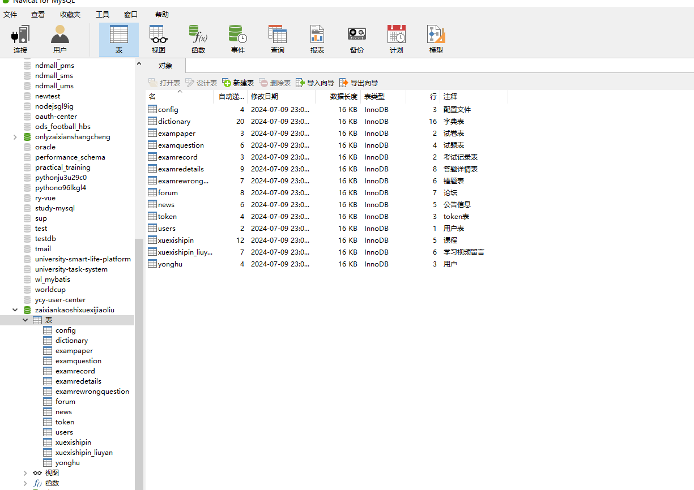

登录

前台页面首页

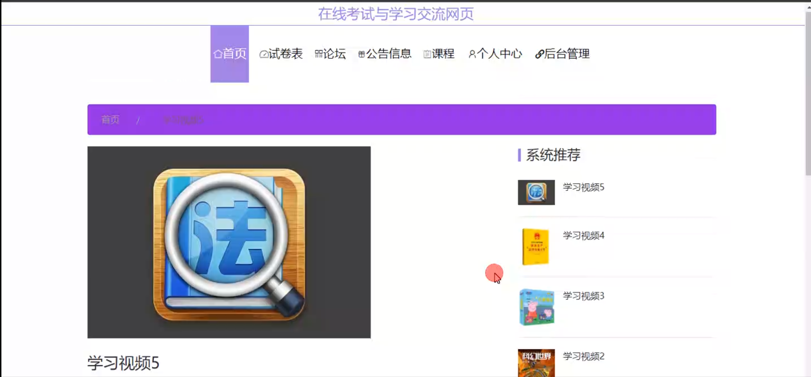

论坛

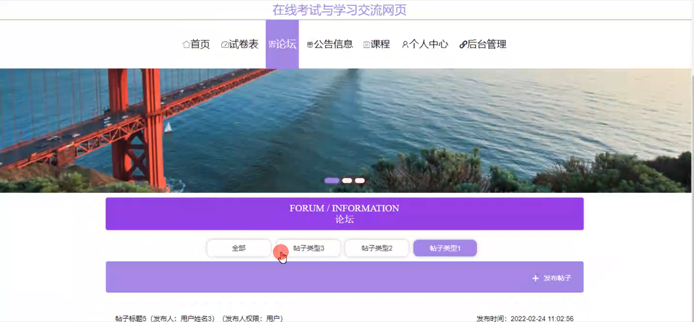

考试界面

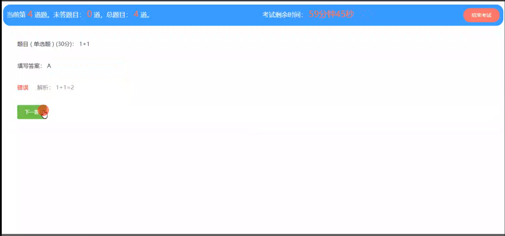

个人中心

管理员端管理员管理

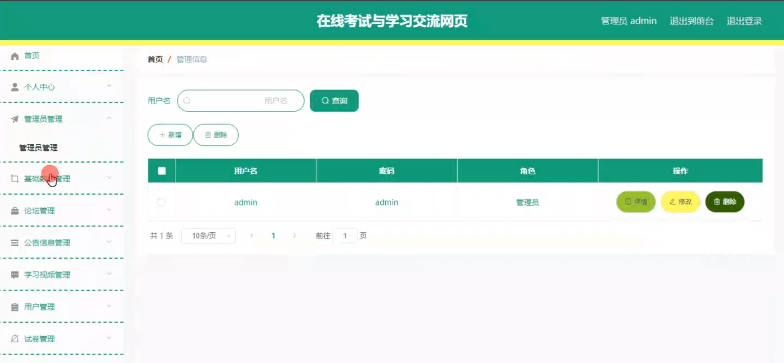

基础数据管理

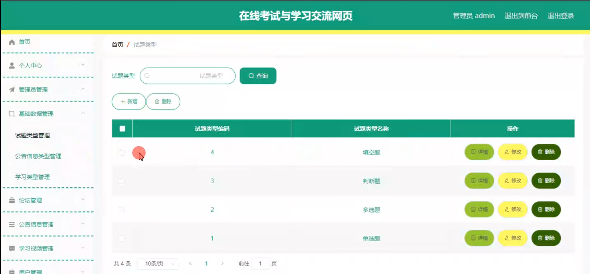

公告信息管理

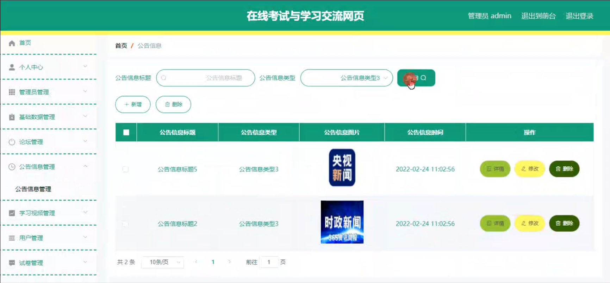

学生视频管理

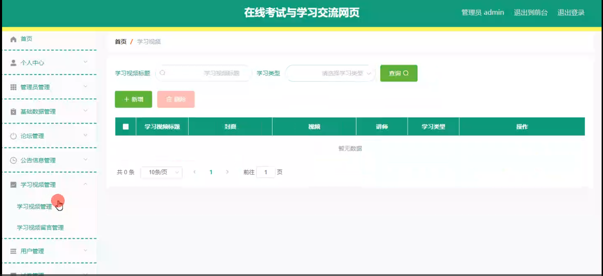

试卷管理

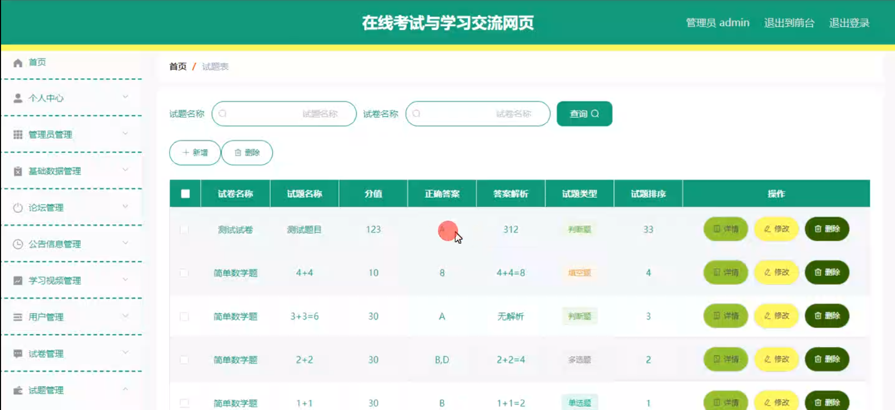

试题管理

考试管理

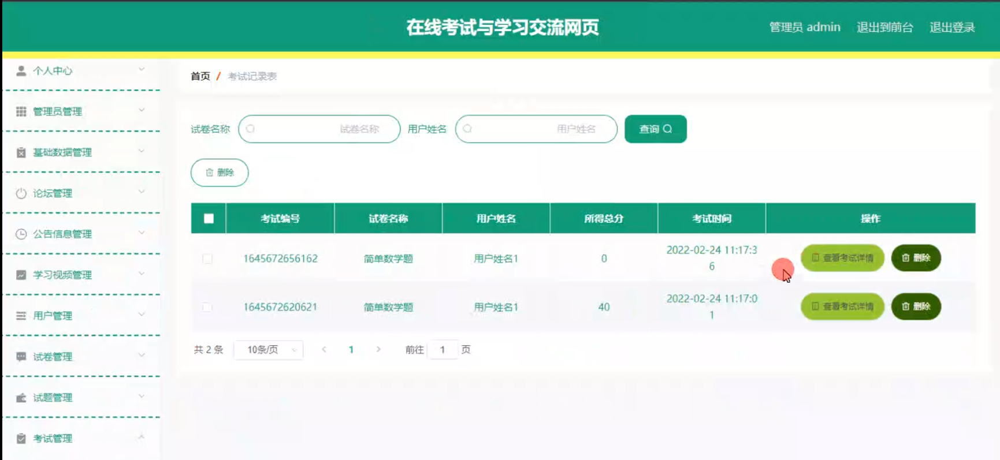

用户端后台管理

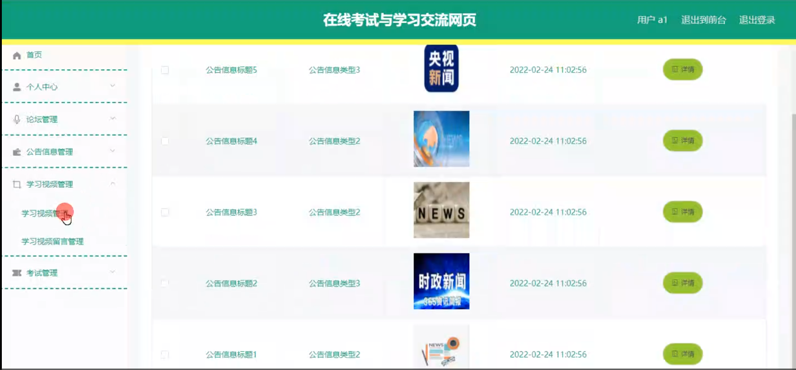

错题本

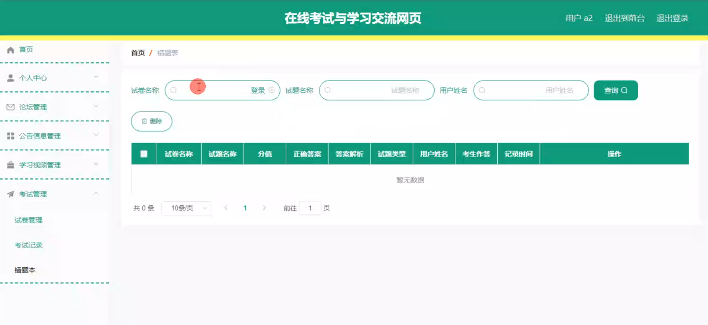

#### 总结

基于 JAVA 语言的在线考试与学习交流网页平台通过丰富的功能模块和明确的角色分工，为学习者提供了一个优质的在线学习和考试环境，为管理员提供了高效的管理工具。它有助于推动教育的数字化发展，提高学习效果和教学管理水平，满足了现代教育和学习的需求。

#### 使用说明

创建数据库，执行数据库脚本 修改jdbc数据库连接参数 下载安装maven依赖jar 启动idea中的springboot项目

前台登录页面
http://localhost:8080/zaixiankaoshixuexijiaoliu/front/index.html

后台登录页面
http://localhost:8080/zaixiankaoshixuexijiaoliu/admin/dist/index.html

管理员			账户:admin 	密码：admin
用户				账户:a1 		密码：123456
用户				账户:a2 		密码：123456
用户				账户:a3 		密码：123456